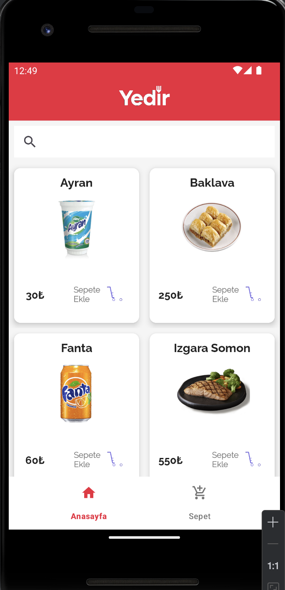
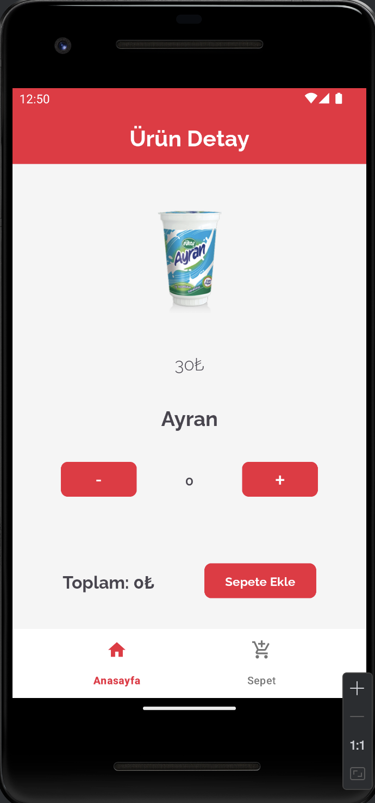
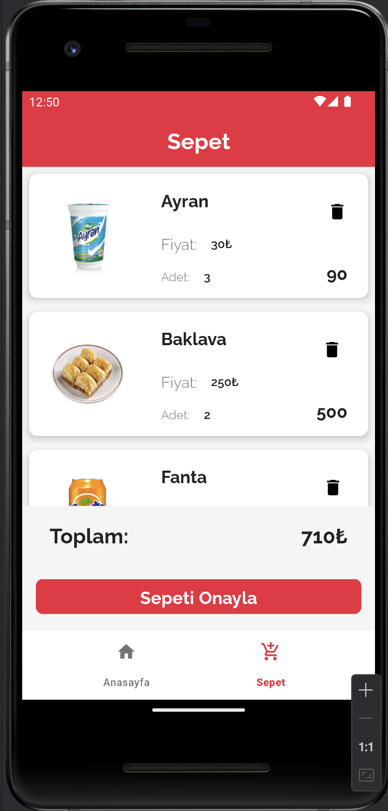

# Pupilica Android Bootcamp Bitirme Projesi: Yedir

### İstenilenler
- Webservices'ten yemek verilerinin çekilmesi.
- Yemeklerin sepete eklenebilmesi.
- Sepete eklenen yemeklerin verilerinin çekilmesi.
- Sepete eklenen yemeklerin silinebilmesi.

### Eksta Özellikler
- Ana menüde arama yapılabilmesi.
- Lottifiles ile animasyonların implementesi
- Sepeti onayla tuşuna basıldığında sepetteki tüm verilerin silinmesi

### Çözülen Eksiklikler
- Sepete aynı ürünün birden fazla kez eklenmesi engellendi(adet güncellemesi)
- Sepete liste dönülmemesi durumunun kontrolü sağlandı.

### Tasarım
- Yazı Fontu olarak Raleway light, semibold ve bold kullanıldı.

### Anamenü

- Ana menüdeki toolbar içerisinde title yerine ImageView kullanılarak logo tasarlanıp koyuldu.
- Card tasarımı yapıldı ve RecyclerView içersinde adapter sayesinde kullanıldı.
- BottomNavigationBar kullanıldı ve seçili itemin kırmızı seçili olmayan itemin gri olması sağlandı.
 

### Detay

- Adet seçme kısmı burada yapıldı.
- Kullanıcının 0 ve daha az adet seçmesi engellendi
- Adet seçimi için + ve - olmak üzere 2 Button kullanıldı.
 

### Sepet

- Card tasarımı yapıldı ve RecyclerView içersinde adapter sayesinde kullanıldı.
- RecyclerView'in altına kullanıcının toplam tutarı görebileceği ve sipariş verebileceği Button tasarlandı.
